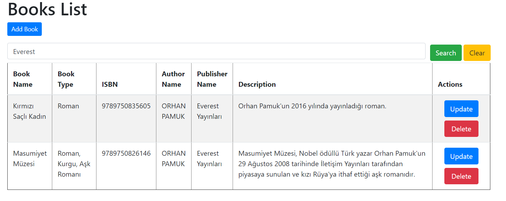

**Run**
```
cd Library-Project-with-SpringBoot-and-Thymeleaf

java -jar target\app.jar --spring.config.location=target\application.yaml
```
**Author**

Author List
http://localhost:8080/author/list


Add Author 
http://localhost:8080/newAuthorForm


Update Author 
http://localhost:8080/showFormForUpdate/1


**Publisher**

Publisher List
http://localhost:8080/publisher/list


Add Publisher 
http://localhost:8080/newPublisherForm


Update Publisher 
http://localhost:8080/updatePublisher/1


**Book**

Book List
http://localhost:8080/book/list


Add Book 
http://localhost:8080/newBookForm


Update Book
http://localhost:8080/updateBook/2


SearchByPublisherName




SearchByBookName


SearchByISBN


